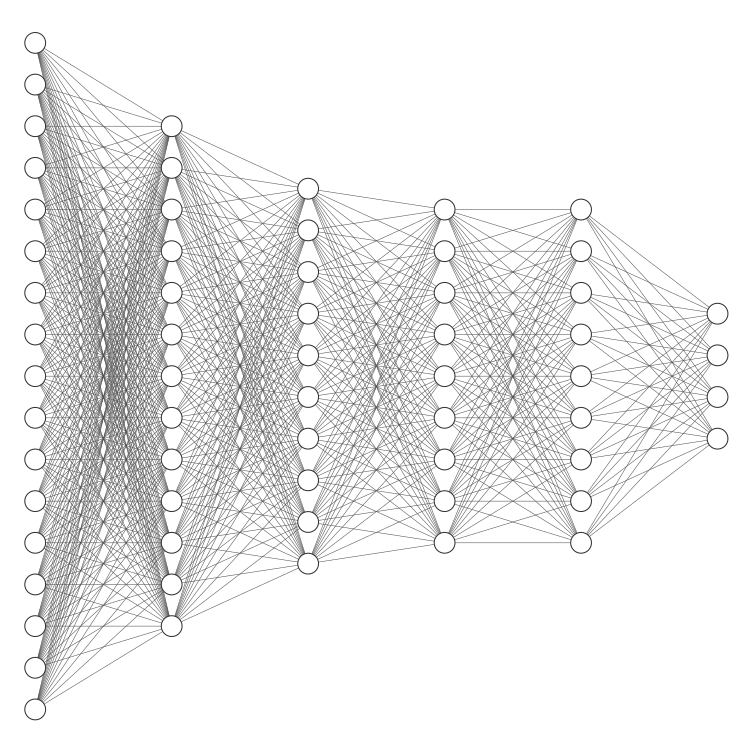
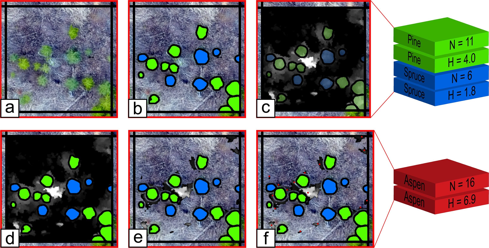
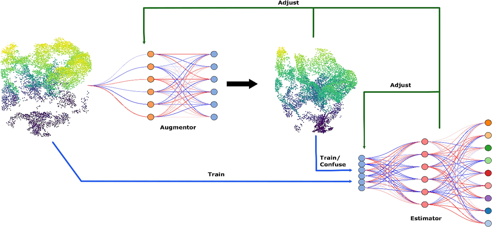
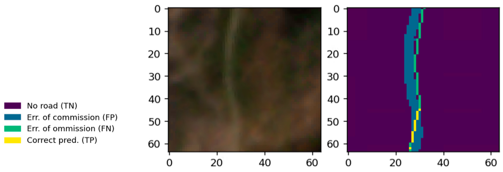

# Integrate Remote Sensing Studio AI Publications

  

## Tree Delineation and Species Classification from UAV Imagery

Chadwick, A., Coops, N., Bater, C., Martens, L., White, B., 2024. Transferability of a Mask R-CNN model for the delineation and classification of two species of regenerating tree crowns to untrained sites. SCIENCE OF REMOTE SENSING 9. [https://doi.org/10.1016/j.srs.2023.100109](https://doi.org/10.1016/j.srs.2023.100109)

Chadwick, A., Coops, N., Bater, C., Martens, L., White, B., 2022. Species Classification of Automatically Delineated Regenerating Conifer Crowns Using RGB and Near-Infrared UAV Imagery. IEEE GEOSCIENCE AND REMOTE SENSING LETTERS 19. [https://doi.org/10.1109/LGRS.2021.3123552](https://doi.org/10.1109/LGRS.2021.3123552)

Chadwick, A., Goodbody, T., Coops, N., Hervieux, A., Bater, C., Martens, L., White, B., Röeser, D., 2020. Automatic Delineation and Height Measurement of Regenerating Conifer Crowns under Leaf-Off Conditions Using UAV Imagery. REMOTE SENSING 12. [https://doi.org/10.3390/rs12244104](https://doi.org/10.3390/rs12244104)

Chadwick, A.J., Coops, N.C., Johnson, K.M., Bater, C.W., Martens, L.A., Röeser, D., White, B., 2025. A remote sensing methodology for sub-stand growth and yield projection of post-harvest forest regeneration. Forestry: An International Journal of Forest Research 98, 454–463. [https://doi.org/10.1093/forestry/cpae051](https://doi.org/10.1093/forestry/cpae051)

## Biomass Estimation from Airborne Laser Scanning Data

Seely, H., Coops, N.C., White, J.C., Montwé, D., Winiwarter, L., Ragab, A., 2023. Modelling tree biomass using direct and additive methods with point cloud deep learning in a temperate mixed forest. Science of Remote Sensing 8, 100110. [https://doi.org/10.1016/j.srs.2023.100110](https://doi.org/10.1016/j.srs.2023.100110)

Seely, H., Coops ,Nicholas C., White ,Joanne C., Montwé ,David, and Ragab, A., 2025. Forest aboveground biomass estimation using deep learning data fusion of ALS, multispectral, and topographic data. International Journal of Remote Sensing 0, 1–39. [https://doi.org/10.1080/01431161.2025.2492412](https://doi.org/10.1080/01431161.2025.2492412)

## Tree Species Proportion Estimation and Classification from Airborne Laser Scanning Data

Murray, B., Coops, N., Winiwarter, L., White, J., Dick, A., Barbeito, I., Ragab, A., 2024. Estimating tree species composition from airborne laser scanning data using point-based deep learning models. ISPRS JOURNAL OF PHOTOGRAMMETRY AND REMOTE SENSING 207, 282–297. [https://doi.org/10.1016/j.isprsjprs.2023.12.008](https://doi.org/10.1016/j.isprsjprs.2023.12.008)

Murray, B.A., Coops, N.C., White, J.C., Dick, A., Barbeito, I., Ragab, A., 2025. Individual tree species prediction using airborne laser scanning data and derived point-cloud metrics within a dual-stream deep learning approach. International Journal of Applied Earth Observation and Geoinformation 144, 104877. [https://doi.org/10.1016/j.jag.2025.104877](https://doi.org/10.1016/j.jag.2025.104877)

Murray, B.A., Coops ,Nicholas C., White ,Joanne C., Dick ,Adam, and Ragab, A., 2025. Tree species proportion prediction using airborne laser scanning and Sentinel-2 data within a deep learning based dual-stream data fusion approach. International Journal of Remote Sensing 0, 1–29. [https://doi.org/10.1080/01431161.2025.2521072](https://doi.org/10.1080/01431161.2025.2521072)

Cao, Y., Coops, N.C., Murray, B.A., Sinclair, I., 2025. Enhancing tree species composition mapping using Sentinel-2 and multi-seasonal deep learning fusion. International Journal of Remote Sensing 1–27. [https://doi.org/10.1080/01431161.2025.2583600](https://doi.org/10.1080/01431161.2025.2583600)

Puliti, S., Lines, E.R., Müllerová, J., Frey, J., Schindler, Z., Straker, A., Allen, M.J., Winiwarter, L., Rehush, N., Hristova, H., Murray, B., Calders, K., Coops, N., Höfle, B., Irwin, L., Junttila, S., Krůček, M., Krok, G., Král, K., Levick, S.R., Luck, L., Missarov, A., Mokroš, M., Owen, H.J.F., Stereńczak, K., Pitkänen, T.P., Puletti, N., Saarinen, N., Hopkinson, C., Terryn, L., Torresan, C., Tomelleri, E., Weiser, H., Astrup, R., 2025. Benchmarking tree species classification from proximally sensed laser scanning data: Introducing the FOR-species20K dataset. Methods in Ecology and Evolution 16, 801–818. [https://doi.org/10.1111/2041-210X.14503](https://doi.org/10.1111/2041-210X.14503)

## Extraction of Forest Road Information from High-Resolution Satellite Imagery

Winiwarter, L., Coops, N.C., Bastyr, A., Roussel, J.-R., Zhao, D.Q., Lamb, C.T., Ford, A.T., 2024. Extraction of forest road information from cubesat imagery using convolutional neural networks. Remote Sensing 16, 1083. [https://doi.org/10.3390/rs16061083](https://doi.org/10.3390/rs16061083)